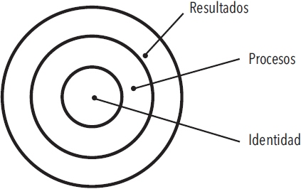
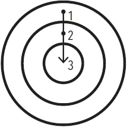
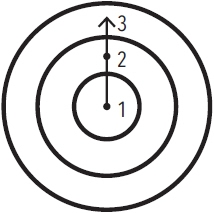

# Capítulo 2. La manera en que tus hábitos moldean tu identidad (y viceversa)

<!--- ### Page 52 @ 15 March 2023 11:45 PM -->
Cambiar tus hábitos resulta desafiante por dos motivos:

1) tratamos de cambiar algo que no es lo que debemos cambiar y
2) tratamos de cambiar nuestros hábitos de la manera equivocada.

<!--- ### Page 52 @ 15 March 2023 11:46 PM -->
> Nuestro primer error consiste en tratar de cambiar algo que no es lo que debemos cambiar.

<!--- ### Page 52 @ 15 March 2023 11:45 PM -->
##### Las tres capas del cambio de conducta

<!--- ### Page 52 @ 15 March 2023 11:46 PM -->
Hay que tener en cuenta que existen tres niveles en los que los cambios pueden ocurrir.

<!--- ### Page 53 @ 15 March 2023 11:47 PM -->
<!--- ### Page 53 @ 15 March 2023 11:47 PM -->
* La primera capa incluye **cambiar tus resultados**. Este nivel se relaciona con el cambio de los resultados. La mayoría de las metas que te propones lograr están asociadas con este nivel de cambio.

<!--- ### Page 53 @ 15 March 2023 11:57 PM -->
<!--- ### Page 53 @ 15 March 2023 11:58 PM -->
* La segunda capa incluye **cambiar tus procesos**. Este nivel se relaciona con el cambio de hábitos y sistemas. La mayoría de los hábitos que desarrollas están asociados con este nivel.

<!--- ### Page 53 @ 15 March 2023 11:58 PM -->
* La tercera capa, la más profunda, incluye **cambiar tu identidad**. Este nivel se relaciona con cambiar tus creencias: tu visión del mundo, la imagen de ti mismo, tus juicios acerca de ti mismo y de los demás. La mayoría de las creencias, las suposiciones y los prejuicios que mantienes están asociados con este nivel.

<!--- ### Page 53 @ 18 March 2023 09:06 AM -->
**Los resultados tienen que ver con lo que obtienes. Los procesos tienen que ver con lo que haces. La identidad tiene que ver con lo que crees.** Cuando se trata de desarrollar hábitos perdurables —es decir, cuando se trata de desarrollar un sistema de un 1% de mejora—, el problema no radica en definir si un nivel es mejor o peor que otro. El verdadero problema radica en la dirección que sigue el cambio.

<!--- ### Page 53 @ 16 March 2023 08:38 PM -->
##### Hábitos basados en resultados

<!--- ### Page 54 @ 16 March 2023 08:38 PM -->
##### Hábitos basados en la identidad

<!--- ### Page 54 @ 16 March 2023 08:38 PM -->
En los hábitos que están basados en resultados, el enfoque está en lo que queremos lograr. En los hábitos basados en la identidad, el enfoque está en quién queremos llegar a ser.

<!--- ### Page 55 @ 16 March 2023 12:13 AM -->
<!--- ### Page 55 @ 16 March 2023 12:13 AM -->
La mayoría de las personas ni siquiera consideran cambiar su identidad cuando se deciden a mejorar. Establecen metas y determinan las acciones para alcanzar esas metas, pero ni siquiera consideran las creencias que dirigen sus acciones. Nunca cambian la manera como se conciben a sí mismas, y no se dan cuenta de que su vieja identidad puede sabotear sus planes de cambiar.

<!--- ### Page 56 @ 16 March 2023 12:41 AM -->
<!--- ### Page 56 @ 16 March 2023 12:41 AM -->
Siempre existe un sistema de creencias y suposiciones que moldean el sistema, una identidad detrás de los hábitos. **La conducta que no es congruente con el yo no será duradera.**

<!--- ### Page 56 @ 16 March 2023 12:42 AM -->
Es muy difícil cambiar tus hábitos si no cambias las creencias ~~subterráneas~~ que te condujeron a las conductas pasadas que deseas cambiar. Tienes una nueva meta y un nuevo plan, pero no te has transformado a ti mismo.

<!--- ### Page 57 @ 16 March 2023 12:44 AM -->
> La forma máxima de motivación ~~intrínseca~~ se da cuando un hábito se convierte en parte integral de tu identidad.

<!--- ### Page 57 @ 16 March 2023 09:25 AM -->
<!--- ### Page 58 @ 16 March 2023 09:26 AM -->
Cuanto más orgulloso te sientas de un aspecto particular de tu identidad, más motivado estarás para mantener y cultivar los hábitos que están asociados con dicho aspecto. **Una vez que tu orgullo se involucra, de forma natural luchas con uñas y dientes para mantener tus hábitos.**

<!--- ### Page 59 @ 16 March 2023 09:28 AM -->
Cuando tu conducta y tu identidad están completamente sincronizadas, ya no intentas lograr cambios de conducta. Simplemente estás actuando como la persona que tú crees que eres. (*N. del R. «No existe la posibilidad de que exista conflicto, ya que tu identidad se corresponde congruentemente con tus acciones.»*)

<!--- ### Page 59 @ 16 March 2023 04:30 PM -->
<!--- ### Page 60 @ 16 March 2023 04:30 PM -->
Sin embargo, como todos los aspectos de la formación de hábitos, este también es un arma de doble filo. Cuando te has repetido a ti mismo una historia durante años, es sencillo que te aferres a estas rutinas mentales y las aceptes como un hecho. Con el tiempo, comienzas a resistirte a realizar ciertas acciones porque crees que no son parte de lo que tú eres. Se desarrolla una presión interna para mantener intacta la imagen de ti mismo y tú te comportas de manera consistente con tus creencias.

<!--- ### Page 60 @ 16 March 2023 04:30 PM -->
> Cuanto más profundamente estén vinculados (los hábitos) a tu identidad, las acciones y los pensamientos serán más difíciles de cambiar.

<!--- ### Page 61 @ 16 March 2023 04:34 PM -->
El conflicto con la identidad es la mayor barrera a la que puede enfrentarse el cambio positivo a cualquier nivel (individual, grupal o social). **Los hábitos positivos pueden tener sentido a nivel racional, pero si entran en conflicto con tu identidad, vas a fracasar cuando intentes ponerlos en práctica.**

<!--- ### Page 61 @ 16 March 2023 04:49 PM -->
> El progreso requiere desaprender lo aprendido. Para lograr ser la mejor versión de ti mismo, es necesario que edites constantemente tus creencias y que actualices y expandas tu identidad.

_Generated at: 2023-03-18-09-07-30_
