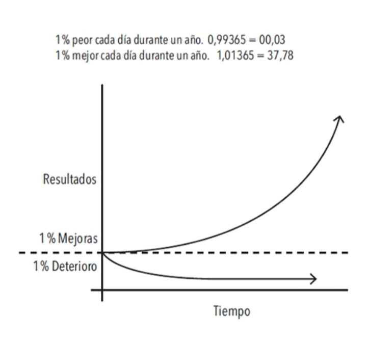

# 1% mejor cada día

**FIGURA 1.** _Los efectos de los pequeños hábitos a lo largo del tiempo. Por ejemplo, si logras ser solamente un 1% mejor cada día, terminarás siendo 37 veces mejor al finalizar el año._

|9.23| Esto puede ser un concepto difícil de apreciar en la vida cotidiana. Frecuentemente descartamos los pequeños cambios porque no parecen importar mucho en un momento dado. Si ahorras un poco de dinero ahora, no te conviertes en millonario. Si vas al gimnasio tres días consecutivos, no te vas a poner en forma. Si estudias chino mandarín una hora por la noche, no habrás aprendido un nuevo idioma. Hacemos pequeños cambios, pero **los resultados nunca se dan de manera inmediata**; eso nos descorazona y nos lleva de vuelta a nuestras viejas rutinas.

|9.24| Desafortunadamente, el lento ritmo de la transformación también hace que sea muy fácil permitir el retorno de los malos hábitos. Si comes un alimento poco saludable hoy, la báscula no va a registrar un cambio muy drástico. Si hoy trabajas hasta tarde e ignoras a tu familia, te van a perdonar. Si aplazas el trabajo de un proyecto para el día siguiente, seguramente encontrarás el tiempo para terminarlo más adelante. Es fácil pasar por alto una pequeña mala decisión.

|9.25| Sin embargo, cuando repetimos día a día esos errores que representan apenas un 1%, cuando repetimos las malas decisiones y duplicamos los pequeños errores mediante excusas sin importancia, nuestras acciones acaban por producir resultados compuestos que son realmente tóxicos. La acumulación de muchos pasos en falso, un 1% de deterioro aquí y allá, finalmente se convierte en un grave problema.

|9.27| Del mismo modo, un pequeño cambio en tus hábitos cotidianos puede conducir tu vida a un destino completamente distinto. Tomar una decisión que es un 1% mejor o un 1% peor puede no parecer importante en un momento dado, pero en el transcurso de todos los momentos que conforman una vida, estas decisiones determinan la diferencia entre la persona que eres y la persona que podrías ser. **El éxito es el producto de nuestros hábitos cotidianos, no de transformaciones drásticas que se realizan una vez en la vida.**

|9.28| Dicho eso, no importa el éxito que tengas en este preciso momento. Lo que importa es determinar si tus hábitos te están conduciendo hacia el camino del éxito. **Debes preocuparte más de la trayectoria que estás siguiendo en el presente que de los resultados que has alcanzado hasta ahora**. Si eres millonario pero gastas más de lo que ganas cada mes, entonces estás siguiendo una mala trayectoria. Si tus hábitos de consumo no cambian, no vas a terminar bien. En cambio, si estás en quiebra pero consigues ahorrar un poco cada mes, entonces te encuentras en un camino que te conducirá a la libertad financiera, aun si lograrlo te toma más tiempo del que te gustaría.

> |9.29| Tus resultados son los indicadores reactivos[^§] de tus hábitos. La cantidad de dinero que posees es un indicador reactivo de tus hábitos financieros. Tu peso actual es un indicador reactivo de tus hábitos alimenticios. Tu conocimiento es un indicador reactivo de tus hábitos de estudio. El aspecto de tu casa es un indicador reactivo de tus hábitos de orden y limpieza. **Al final obtienes lo que repites.**

|9.30| Si quieres predecir dónde terminarás tu vida, todo lo que tienes que hacer es seguir la curva de las pequeñas ganancias y pérdidas y proyectar cómo tus decisiones diarias se comportan a lo largo de diez o veinte años. ¿Gastas menos de lo que ganas cada mes? ¿Vas al gimnasio varias veces a la semana? ¿Lees libros y aprendes algo nuevo cada día? **Las pequeñas batallas que ganamos cada día son las que definen nuestro futuro.**

|9.31| **El tiempo magnifica el margen entre éxito y fracaso y va a multiplicar aquello que repites con frecuencia.** Los buenos hábitos terminan siendo tus aliados. Los malos hábitos acaban por convertirse en enemigos.

[^§]: _reactivo:_ respuesta a un impulso o estímulo.