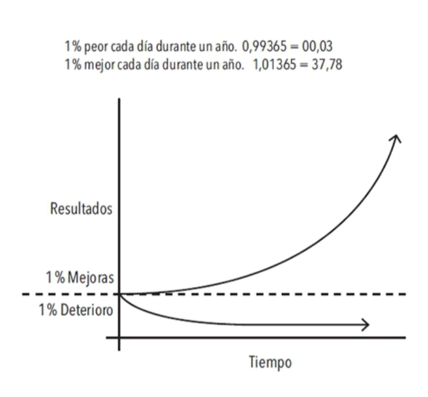

# 1% mejor cada día

**FIGURA 1.** _Los efectos de los pequeños hábitos a lo largo del tiempo. Por ejemplo, si logras ser solamente un 1% mejor cada día, terminarás siendo 37 veces mejor al finalizar el año._

> |9.23| Esto puede ser un concepto difícil de apreciar en la vida cotidiana. Frecuentemente descartamos los pequeños cambios porque no parecen importar mucho en un momento dado. Si ahorras un poco de dinero ahora, no te conviertes en millonario. Si vas al gimnasio tres días consecutivos, no te vas a poner en forma. Si estudias chino mandarín una hora por la noche, no habrás aprendido un nuevo idioma. Hacemos pequeños cambios, pero los resultados nunca se dan de manera inmediata; eso nos descorazona y nos lleva de vuelta a nuestras viejas rutinas.