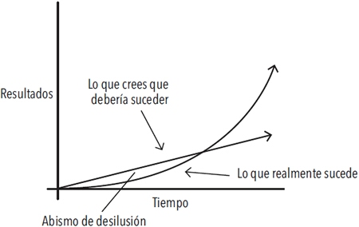

# Capítulo 1. El sorprendente poder de los hábitos atómicos

<!--- ### Page 32 @ 03 March 2023 12:40 PM -->
> Si logras ser solamente un 1% mejor cada día, terminarás siendo 37 veces mejor al finalizar el año.

<!--- ### Page 33 @ 03 March 2023 12:45 PM -->
El éxito es el producto de nuestros hábitos cotidianos, no de transformaciones drásticas que se realizan una vez en la vida.

<!--- ### Page 34 @ 03 March 2023 09:27 PM -->
Dicho eso, no importa el éxito que tengas en este preciso momento. Lo que importa es determinar si tus hábitos te están conduciendo hacia el camino del éxito. *Debes preocuparte más de la trayectoria que estás siguiendo en el presente que de los resultados que has alcanzado hasta ahora.*

<!--- ### Page 34 @ 03 March 2023 09:27 PM -->
Tus resultados son los indicadores reactivos de tus hábitos. La cantidad de dinero que posees es un indicador reactivo de tus hábitos financieros. Tu peso actual es un indicador reactivo de tus hábitos alimenticios. Tu conocimiento es un indicador reactivo de tus hábitos de estudio. El aspecto de tu casa es un indicador reactivo de tus hábitos de orden y limpieza. *Al final obtienes lo que repites.*

<!--- ### Page 35 @ 26 February 2023 03:37 AM -->
> Las pequeñas batallas que ganamos cada día son las que definen nuestro futuro.

<!--- ### Page 35 @ 10 March 2023 12:00 AM -->
*El tiempo magnifica el margen entre éxito y fracaso y va a multiplicar aquello que repites con frecuencia*. Los buenos hábitos terminan siendo tus aliados. Los malos hábitos acaban por convertirse en enemigos.

<!--- ### Page 35 @ 13 March 2023 11:38 PM -->
## Tus hábitos actúan de manera acumulativa a tu favor o en tu contra

<!--- ### Page 35 @ 10 March 2023 12:29 PM -->

| **Hábitos acumulativos favorables** | **Hábitos acumulativos desfavorables** |
|---|---|
| **Productividad:** Lograr terminar una tarea adicional es un pequeño logro en un día determinado, pero cuenta mucho en el transcurso de toda una carrera. El efecto acumulativo de lograr automatizar una tarea antigua para poder dominar una nueva habilidad es aún mayor. Cuantas más tareas seas capaz de realizar de manera automática, sin tener que pensar, más libertad tendrá tu cerebro para centrarse en otras áreas. | **Estrés:** La frustración de un atasco, el peso de las responsabilidades de ser padres, la tensión de no llegar a fin de mes, la preocupación que produce tener la presión arterial un poco más alta de lo normal, etcétera. Por sí solas estas causas de estrés son tolerables, pero si persisten durante años, estas pequeñas preocupaciones se acumulan y se convierten en problemas de salud muy graves.  |
| **Conocimiento:** Aprender una nueva idea no te convierte en un genio, pero mantener un compromiso de aprender algo cada día durante tu vida se convierte en una fuerza transformadora. Cada libro que lees no solo te enseña algo nuevo, también te estimula a repensar de manera distinta las viejas ideas. Como dice Warren Buffett: «Esta es la manera como el conocimiento funciona. Se va acumulando, como el interés compuesto del dinero invertido». | **Pensamientos negativos:** Cuanto más te consideras a ti mismo despreciable, carente de valor, tonto o feo, más te condicionas a interpretar la vida de la misma manera. Tu pensamiento queda atrapado en un círculo vicioso. Lo mismo ocurre con tu manera de pensar acerca de los demás. Una vez que caes en el hábito de considerar a las personas como malhumoradas, injustas o egoístas, empiezas a ver a ese tipo de personas en todas partes. |
| **Relaciones sociales:** Las personas reflejan la manera como te comportas con ellas. Cuanto más ayudas a los demás, más querrán ayudarte a ti. Ser un poco más amable en cada interacción con las personas, con el paso del tiempo termina por convertirse en una amplia y duradera red de conexiones. | **Indignación:** Los disturbios, protestas, movimientos de masas rara vez son producto de un acontecimiento aislado. Al contrario, una serie de agresiones menores y afectaciones repetidas se multiplican lentamente hasta que un acontecimiento se convierte en la gota que derrama el vaso y la indignación se extiende como un incendio. |

<!--- ### Page 36 @ 13 March 2023 11:30 PM -->
## ¿En qué consiste realmente el progreso?

<!--- ### Page 37 @ 13 March 2023 11:18 PM -->
Los grandes hitos o momentos definitorios con frecuencia son el resultado de muchos acontecimientos previos que acumulan el potencial requerido para desencadenar un gran cambio.

<!--- ### Page 37 @ 26 February 2023 03:49 AM -->
> El bambú apenas se alcanza a ver durante los primeros cinco años. Durante ese tiempo desarrolla un complejo sistema de raíces que, una vez maduro, le permite crecer más de 2 metros en menos de seis semanas.

<!--- ### Page 38 @ 11 March 2023 07:43 PM -->
Uno siempre espera realizar progresos de manera lineal y ascendente, por ello es frustrante cuando a lo largo de períodos de días, semanas e incluso meses los cambios parecen no funcionar y uno tiene la sensación de permanecer en el mismo sitio. Es el sello de cualquier proceso acumulativo: *los resultados más poderosos toman su tiempo y se retrasan.*

<!--- ### Page 38 @ 20 March 2023 03:45 PM -->
Esta es una de las razones por las que es tan difícil desarrollar hábitos que perduren. La gente hace pequeños cambios de conducta, no ve resultados tangibles y toma la decisión de detenerse.

<!--- ### Page 38 @ 20 March 2023 03:46 PM -->
Para que los hábitos realmente generen un cambio, deben subsistir lo suficiente como para rebasar una meseta donde no se producen cambios perceptibles.

<!--- ### Page 39 @ 10 March 2023 12:08 AM -->
> El trabajo no se desperdicia, solo se acumula.

<!--- ### Page 39 @ 20 March 2023 03:53 PM -->
Cuando al fin logras ir más allá de «la meseta del potencial latente», la gente considera que el hecho es un éxito conseguido de la noche a la mañana. La mayoría de la gente solo percibe los eventos más llamativos y no se detiene a ver todo el trabajo y el esfuerzo que tienen detrás. Pero únicamente tú sabes que todo el trabajo que has invertido durante mucho tiempo, cuando parecía que no estabas haciendo ningún progreso, es lo que realmente hizo posible el cambio.

<!--- ### Page 40 @ 20 March 2023 03:43 PM -->
## La meseta de potencial latente

<!--- ### Page 40 @ 26 February 2023 03:48 AM -->
> Solemos suponer que el progreso se da de manera lineal y ascendente. Por lo menos esperamos que suceda rápido. En la realidad, los resultados de nuestros esfuerzos suelen tomar tiempo y retrasarse. **No es sino meses o incluso años después cuando nos damos cuenta del verdadero valor de todo el trabajo que hemos realizado.** Esto puede tener como resultado un «abismo de desilusión», un punto en el que la gente se siente descorazonada tras haber invertido semanas o incluso meses de trabajo duro sin experimentar ningún resultado aparente. Sin embargo, su trabajo no se desperdició. Tan solo se acumuló. No es hasta mucho tiempo después cuando el verdadero valor del esfuerzo previo es revelado.

<!--- ### Page 41 @ 20 March 2023 02:32 PM-->
## Olvida las metas y mejor céntrate en los sistemas

<!--- ### Page 42 @ 27 February 2023 12:45 AM -->
<!--- ### Page 42 @ 27 February 2023 12:44 AM -->
¿Cuál es la diferencia entre metas y sistemas? Las *metas* son los resultados que quieres obtener. Los *sistemas* son los procesos que sigues para alcanzar esos resultados.

<!--- ### Page 43 @ 26 February 2023 03:55 AM -->
Un montón de problemas surgen cuando pasas demasiado tiempo pensando en tus metas en lugar de dedicar el tiempo a diseñar tus sistemas.

<!--- ### Page 44 @ 27 February 2023 12:33 AM -->
* *Problema 1:* Los ganadores y los perdedores comparten las mismas metas.

<!--- ### Page 44 @ 26 February 2023 03:54 AM -->
Si la gente que tiene éxito y la que no lo consigue comparten la misma meta, esta última no puede ser lo que distingue a los ganadores de los perdedores.

<!--- ### Page 45 @ 27 February 2023 12:34 AM -->
* *Problema 2:* Alcanzar una meta consiste únicamente en un cambio momentáneo.

<!--- ### Page 45 @ 27 February 2023 12:36 AM -->
Cuando logras alcanzar una meta, tu vida cambia únicamente durante un momento. Esa es la paradoja de las mejoras. **Pensamos que debemos cambiar los resultados pero los resultados no son el problema. Lo que realmente necesitamos cambiar son los sistemas que nos llevan a tener esos resultados. Cuando resuelves problemas a partir de los resultados, solamente los resuelves de manera momentánea.**

<!--- ### Page 45 @ 26 February 2023 03:58 AM -->
> Arregla los sistemas y los resultados se arreglarán por sí mismos.

<!--- ### Page 46 @ 27 February 2023 12:24 AM -->
* *Problema 3:* Las metas restringen la felicidad.

<!--- ### Page 46 @ 27 February 2023 12:19 PM -->
La suposición implícita que está detrás de cualquier meta es la siguiente: «Una vez que alcance mi meta, seré feliz». El problema con una mentalidad que privilegia las metas es que siempre se pospone la felicidad hasta que se logra alcanzar el siguiente hito.

<!--- ### Page 46 @ 27 February 2023 12:27 AM -->
Es más, la mentalidad que se rige por la consecución de metas acaba por crear un conflicto de exclusión: o alcanzas tu meta y tienes éxito o fallas y eres un fracaso.

<!--- ### Page 46 @ 27 February 2023 12:27 AM -->
> No tiene sentido que restrinjas tu felicidad y satisfacción a un solo escenario, cuando existen muchos caminos que conducen al éxito.

<!--- ### Page 46 @ 27 February 2023 12:28 AM -->
Una mentalidad que privilegia los sistemas te proporciona un antídoto. **Cuando te enamoras del proceso más que del producto final, no tienes que esperar hasta el desenlace para permitirte ser feliz.** Puedes sentirte satisfecho y feliz siempre que tu sistema esté funcionando. Y los sistemas pueden funcionar bien de muchas maneras distintas, no solamente de la manera en que lo concebiste al principio.

<!--- ### Page 47 @ 27 February 2023 12:29 AM -->
* *Problema 4:* Las metas no coinciden con el progreso a largo plazo.

<!--- ### Page 47 @ 27 February 2023 12:30 AM -->
Cuando todo tu trabajo se centra en una meta en particular, ¿qué queda para motivarte una vez que la alcanzas? Esta es la razón por la cual muchas personas regresan a sus viejos hábitos malos una vez que alcanzan una meta.

<!--- ### Page 47 @ 27 February 2023 12:31 AM -->
**El propósito de definir metas consiste en convertirse en un ganador de una sola ocasión.** El propósito de construir sistemas consiste en seguir participando en el juego. La mentalidad que verdaderamente se centra en el largo plazo no se centra en el cumplimiento de metas. No se trata de alcanzar metas aisladas. Se trata de un ciclo de refinamiento interminable y de mejora continua. Por encima de todo, tu compromiso con el proceso es lo que va a determinar tu progreso.

<!--- ### Page 48 @ 20 March 2023 01:55 PM -->
## Un sistema de hábitos atómicos

<!--- ### Page 48 @ 27 February 2023 12:38 AM -->
Si tienes problemas para cambiar tus hábitos, el problema no eres tú. El problema es tu sistema. Los malos hábitos se repiten constantemente no porque tú no los quieras cambiar, sino porque tienes un sistema que no funciona.

<!--- ### Page 48 @ 27 February 2023 12:38 AM -->
> Un hábito atómico se refiere a un cambio pequeño, a una ganancia marginal, a un 1% de mejora.

<!--- ### Page 48 @ 27 February 2023 12:40 AM -->
Al principio estas pequeñas rutinas parecen ser insignificantes, pero pronto se acumulan y se convierten en un combustible que genera ganancias tan importantes que sobrepasan con creces el coste de las inversiones iniciales.

<!--- ### Page 49 @ 27 February 2023 12:40 AM -->
Este es el significado de la expresión «hábitos atómicos», una práctica regular o rutina que no es solamente pequeña y fácil de realizar, también es la fuente de un poder increíble. Un componente de un sistema de crecimiento compuesto.

<!--- ### Page 49 @ 20 March 2023 02:26 PM -->
## Resumen del capítulo

* Los hábitos son el interés compuesto de la superación personal. Trabajar para lograr ser un 1% mejor cada día cuenta mucho a la larga.
* Los hábitos son una espada de doble filo. Pueden trabajar a tu favor o en tu contra. Por este motivo, entender los detalles es indispensable.
* Los pequeños cambios con frecuencia parecen no tener ningún efecto hasta que logras cruzar un umbral crítico. Los resultados más poderosos de cualquier proceso acumulativo suelen retrasarse. Debes aprender a ser paciente.
* Un hábito atómico es un pequeño hábito que forma parte de un sistema más complejo. De la misma manera en que los átomos son los ladrillos de las moléculas, los hábitos atómicos son los ladrillos de los resultados excepcionales.
* Si quieres mejores resultados, olvídate de fijar metas. En lugar de eso, concéntrate en tu sistema.
* No te elevas al nivel de tus metas. Desciendes al nivel de tus sistemas.
