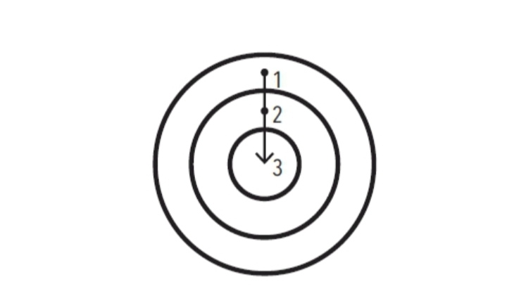

# Las tres capas del cambio de conducta

|10.11| **FIGURA 3.** *El cambio de conducta está formado por tres capas o niveles: un cambio en tus resultados, uno en tus procesos y uno en tu identidad.*

|10.13| Nuestro primer error consiste en tratar de cambiar algo que no es lo que debemos cambiar. Para comprender lo que quiero decir, hay que tener en cuenta que existen tres niveles en los que los cambios pueden ocurrir. Imagínalos como las capas de una cebolla.

## La primera capa incluye cambiar tus resultados

|10.15| Este nivel se relaciona con el cambio de los resultados: perder peso, publicar un libro, ganar un campeonato. La mayoría de las metas que te propones lograr están asociadas con este nivel de cambio.

## La segunda capa incluye cambiar tus procesos

|10.16| Este nivel se relaciona con el cambio de hábitos y sistemas: implementar una nueva rutina en el gimnasio, organizar tu escritorio para tener un mejor flujo de trabajo, desarrollar una práctica de meditación. La mayoría de los hábitos que desarrollas están asociados con este nivel.

## La tercera capa, la más profunda, incluye cambiar tu identidad

|10.17| Este nivel se relaciona con cambiar tus creencias: tu visión del mundo, la imagen de ti mismo, tus juicios acerca de ti mismo y de los demás. La mayoría de las creencias, las suposiciones y los prejuicios que mantienes están asociados con este nivel.

|10.18| **Los resultados tienen que ver con lo que obtienes. Los procesos tienen que ver con lo que haces. La identidad tiene que ver con lo que crees.** Cuando se trata de desarrollar hábitos perdurables —es decir, cuando se trata de desarrollar un sistema de un 1% de mejora —, el problema no radica en definir si un nivel es mejor o peor que otro. El verdadero problema radica en la dirección que sigue el cambio.

## Hábitos basados en resultados

## Hábitos basados en la identidad

|10.26| **FIGURA 4.** *En los hábitos que están basados en resultados, el enfoque está en lo que queremos lograr. En los hábitos basados en la identidad, el enfoque está en quién queremos llegar a ser.*

|10.28| La mayoría de las personas comienzan el proceso de cambiar sus hábitos centrándose en *aquello* que quieren alcanzar. Esto los conduce a hábitos que están basados en las metas o resultados. La alternativa apropiada es construir hábitos basados en cambios de identidad. Con este planteamiento empezamos por centrarnos en *quién* queremos llegar a ser.

|10.31| La mayoría de las personas ni siquiera consideran cambiar su identidad cuando se deciden a mejorar. Únicamente piensan, «Quiero ser delgado (*resultado*) y si me apego a esta dieta, adelgazaré (*proceso*)». Establecen metas y determinan las acciones para alcanzar esas metas, pero ni siquiera consideran las creencias que dirigen sus acciones. Nunca cambian la manera como se conciben a sí mismas, y no se dan cuenta de que su vieja identidad puede sabotear sus planes de cambiar.

|10.33| Siempre existe un sistema de creencias y suposiciones que moldean el sistema, una identidad detrás de los hábitos.

|10.34| **La conducta que no es congruente con el yo no será duradera.** Puedes querer tener dinero, pero si tu identidad es la de una persona que consume en lugar de crear, seguirás siendo proclive a gastar más que a ganar. Puedes querer mejorar tu salud, pero si tu prioridad es la comodidad más que el esfuerzo, seguirás prefiriendo relajarte y descansar más que entrenar. Es muy difícil cambiar tus hábitos si no cambias las creencias subterráneas que te condujeron a las conductas pasadas que deseas cambiar. Tienes una nueva meta y un nuevo plan, pero no te has transformado a ti mismo.

|10.38| La forma máxima de motivación intrínseca se da cuando un hábito se convierte en parte integral de tu identidad. Una cosa es decir «soy el tipo de persona que *quiere* esto»; otra cosa muy distinta es poder decir «soy el tipo de persona que *es* esto».

|10.39| Cuanto más orgulloso te sientas de un aspecto particular de tu identidad, más motivado estarás para mantener y cultivar los hábitos que están asociados con dicho aspecto. Si estás orgulloso del aspecto de tu cabello, seguramente desarrollarás una serie de hábitos para cuidarlo y mantenerlo en buen estado. Si estás orgulloso del tamaño de tus bíceps, seguramente nunca te saltarás los ejercicios para fortalecer la parte superior del cuerpo de tu rutina de ejercicios. Si estás orgulloso de las bufandas que tejes, seguramente invertirás horas cada semana en tejer. Una vez que tu orgullo se involucra, de forma natural luchas con uñas y dientes para mantener tus hábitos.

|10.40| El verdadero cambio de conducta es un cambio de identidad. Puedes iniciar un hábito porque tienes la motivación para adquirirlo, pero la única razón por la cual lo mantienes y lo cultivas es porque se convierte en parte de tu identidad.

- La meta no es leer un libro, la meta es convertirse en lector.
- La meta no es correr un maratón, la meta es convertirse en corredor.
- La meta no es aprender a tocar un instrumento, la meta es convertirse en músico.

|10.46| Tus conductas suelen ser un reflejo de tu identidad. Lo que haces es un indicador del tipo de persona que crees que eres —independientemente de que esto se dé a nivel consciente o inconsciente—.

|10.47| Como todos los aspectos de la formación de hábitos, este también es un arma de doble filo. Cuando trabaja a tu favor, el cambio de identidad puede ser una poderosa fuerza de superación personal. En cambio, cuando trabaja en tu contra, el cambio de identidad puede ser una maldición. Una vez que has adoptado una identidad, es fácil que tu lealtad hacia ella influya en tu capacidad para cambiar. Mucha gente avanza por la vida en medio de un adormecimiento cognitivo, siguiendo ciegamente las normas asociadas a su identidad.

- «Soy pésimo para seguir instrucciones.»
- «No sirvo para despertarme temprano.»
- «Soy malísimo para recordar los nombres de las personas.»
- «Siempre llego tarde.»
- «Soy un negado para la tecnología.»
- «Soy pésimo para las matemáticas.»

|10.57| Cuando te has repetido a ti mismo una historia durante años, es sencillo que te aferres a estas rutinas mentales y las aceptes como un hecho. Con el tiempo, comienzas a resistirte a realizar ciertas acciones porque crees que no son parte de lo que tú eres. Se desarrolla una presión interna para mantener intacta la imagen de ti mismo y tú te comportas de manera consistente con tus creencias.[^1] Encuentras todas las maneras posibles de evitar caer en contradicciones con esa imagen que tienes de ti mismo.

|10.58| Cuanto más profundamente estén vinculados a tu identidad, las acciones y los pensamientos serán más difíciles de cambiar. Puede parecer cómodo creer en lo que tu entorno cultural cree (identidad de grupo) o hacer aquello que sustenta tu autoimagen (identidad personal), a pesar de que no sea correcto y te perjudique. El conflicto con la identidad es la mayor barrera a la que puede enfrentarse el cambio positivo a cualquier nivel (individual, grupal o social). Los hábitos positivos pueden tener sentido a nivel racional, pero si entran en conflicto con tu identidad, vas a fracasar cuando intentes ponerlos en práctica.

|10.59| Un día cualquiera quizá te encuentres buscando excusas para no cumplir con tus hábitos positivos simplemente porque estás demasiado cansado, o demasiado ocupado o demasiado abrumado o por un sinfín de pretextos distintos. Al fin y al cabo, sin embargo, la verdadera razón por la cual dejas de cumplir con tus hábitos es porque la imagen que tienes de ti mismo se interpone en el camino. Esta es la razón por la cual no puedes aferrarte a una versión única de identidad. El progreso requiere desaprender lo aprendido. Para lograr ser la mejor versión de ti mismo, es necesario que edites constantemente tus creencias y que actualices y expandas tu identidad.

[^1]: Leon Festinger, A Theory of Cognitive Dissonance, Stanford, California, Stanford University Press, 1957 [Teoría de la disonancia cognoscitiva, Madrid, Instituto de Estudios Políticos, 1975].

